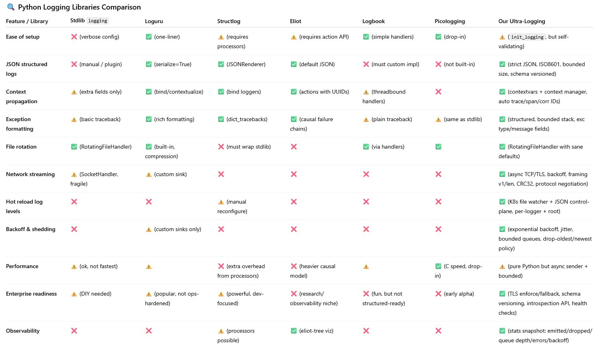

# 🌌 Long Horizon LLM

**Long Horizon LLM** is an experimental framework for **long-form reasoning with language models**.
It combines a Python reasoning engine (FastAPI) with a Next.js frontend, exposing a small HTTP API and web UI.
The goal: explore how LLMs can **plan, execute, critique, and synthesize** multi-step solutions instead of answering in one pass.

---

## ✨ Features

* **Structured reasoning pipeline**: classify → plan → execute → critique → synthesize
* **Backend API**: FastAPI with `/v1/run` and `/v1/run/stream` endpoints
* **Frontend UI**: Next.js app with local/“sovereign” model option and Express proxy
* **Offline demo**: in-browser fallback LLM for quick experimentation
* **Blackboard engine**: DAG-based orchestration with QA loops, judges, contradiction checks, and memory

## 📊 Delta to SOTA Table
| Dimension         | Static Pipelines | ToT / GoT            | ReAct               | bMAS (2025)                   | **Long Horizon LLM**                              |
| ----------------- | ---------------- | -------------------- | ------------------- | ----------------------------- | ------------------------------------------------- |
| **Graph**         | Fixed DAG        | Dynamic tree/graph   | Step-by-step        | Shared blackboard             | **Planned DAG, self-repairing**                   |
| **Persistence**   | None             | None                 | None                | Shared blackboard (ephemeral) | **Persistent klines + beliefs**                   |
| **Feedback**      | Minimal          | Heuristic scoring    | Critic/reflection   | Iterative agent feedback      | **QA tests + judge ensemble**                     |
| **Adaptation**    | Manual           | Search-based         | LLM picks next step | Control unit selects agents   | **Control-theoretic (budgets, hedging, backoff)** |
| **End Product**   | Node outputs     | Best path            | Tool results        | Consensus answer              | **Cohesive doc + diagnostics**                    |
| **Observability** | Limited          | Logs of thought tree | Logs of actions     | Blackboard trace              | **Structured JSON audits, deterministic seeds**   |


## 🗂️ Project Structure

* **`backend/`**: FastAPI server, pipeline logic, and lean `blackboard.py` used in tests + production
* **`backend/blackboard_pkg/`**: experimental, feature-rich blackboard engine (kept for reference)
* **`frontend/`**: Next.js client that proxies requests to the backend API

---

## Frontend View


---

## 🚀 Getting Started

This repo runs three services:

* **FastAPI backend** on `8000`
* **Express proxy** on `3000`
* **Next.js UI** on `9002`

### Run everything

```bash
./dev.sh
```

This launches all three and streams logs to your terminal.
Stop with <kbd>Ctrl+C</kbd>.

---

### Manual setup

#### Backend

```bash
pip install -r requirements.txt
uvicorn backend.server:app --reload
```

#### Frontend

```bash
cd frontend
npm install
NEXT_PUBLIC_API_BASE_URL=http://localhost:3000/api npm run dev
```

Ensure `frontend/.env` points to the backend:

```env
BACKEND_HTTP_URL=http://localhost:8000
BACKEND_WS_URL=ws://localhost:8000/ws
```

UI: `http://localhost:9002` → choose **Sovereign (local)** in the model selector.

---

## 🔌 API Endpoints

| Method | Path             | Description                               |
| ------ | ---------------- | ----------------------------------------- |
| GET    | `/health`        | Health probe                              |
| POST   | `/v1/run`        | Execute reasoning pipeline (final answer) |
| POST   | `/v1/run/stream` | Stream pipeline milestones (NDJSON)       |
| POST   | `/v1/genai`      | Lightweight text generation               |
| GET    | `/v1/templates`  | List available reasoning templates        |

**Example:**

```bash
curl -X POST http://localhost:3000/api/v1/run \
  -H 'Content-Type: application/json' \
  -d '{"query":"What is AI?"}'
```

---

## 🧠 Blackboard Engine

The **blackboard orchestrator** powers multi-step reasoning. Given a query, it:

1. **Classifies** query complexity (Atomic / Hybrid / Composite)
2. **Plans** a DAG of nodes (subtasks with contracts/tests)
3. **Executes** nodes under concurrency + rate/budget limits
4. **QA & Judges**: iterative checks, auto-patching, and weighted scoring
5. **Detects contradictions** across nodes and reconciles them
6. **Cohesion rewrite**: unifies style and coverage in the final doc
7. **Persists memory**: embeddings + run metadata in a lightweight store


### ⚙️ Core Components

* **Rate limiting & concurrency**: global QPS + semaphore caps
* **Token budgeting & hedging**: track spend; launch delayed backup calls to reduce tail latency
* **Auditing**: structured JSON logs with truncation for safety
* **Memory (kline store)**: dependency-free hashed embeddings, quantized int8 storage, brute-force cosine retrieval
* **Planning**: heuristic classifier + planner LLM → DAG; repairs cycles, prunes invalid deps
* **Node QA**: cheap contract tests (`nonempty`, `regex`, `header_present`, etc.)
* **Judges**: multiple cheap evaluators + adaptive weights; optional LLM judge
* **Cross-artifact checks**: contradiction detection (“X is” vs. “X is not”), reconciliation block
* **Persistence**: run metadata, judge weights, embeddings for future runs

---

## 📊 Strengths & Limitations

**Strengths**

* Strong guardrails: budgets, hedging, retries, audits
* Cheap, dependency-free embeddings & memory
* Clear modular pipeline (plan → execute → QA → compose)
* Extensible: plug in new judges, solvers, or planners

**Limitations**

* Retrieval quality limited by hash embeddings + linear scan
* QA and contradiction checks are shallow heuristics
* Risk of factual drift in auto-rewrites
* File-based memory: no locking, potential concurrency issues
* Token budgeting approximate

---

## 🖥️ Demo

Use `EchoSolver` or `PromptLLM` for zero-dependency demos:

```bash
python backend/blackboard.py "Explain the moon landing."
```

Logs show planning, execution, judges, and the final composed output.

---

Got it — you want a **realistic and comprehensive Done / Not Done checklist** for `blackboard.py` so you can assess what’s complete vs. what still needs attention. Here’s one tailored to the file you showed me:

---

## ✅ Done

* [x] **Imports & setup**

  * Standard libs, typing, numpy, asyncio, logging, regex, JSON, etc.
  * Constants wired in via `.constants` and `kern.core.init_logging`.

* [x] **Logging system**

  * `_LOG` with environment-driven log level.
  * `_AUDIT` with independent stream + no propagation. read more here: https://medium.com/@hmidimahdi279/kern-logging-a-high-performance-structured-logging-for-production-systems-a817eef354f5
* [x] **Error hierarchy**

  * `BlackboardError` + `PlanningError`, `QAError`, `ExecutionError`, `CompositionError`.

* [x] **Core utilities**

  * Text sanitization, safe formatting, safe JSON loads.
  * Hash-based embedding, cosine similarity, quantize/dequantize.

* [x] **Rate limiting**

  * Sliding window limiter.
  * Global limiter with concurrency + QPS.

* [x] **Data models (dataclasses)**

  * `SolverResult`, `Contract`, `Node`, `Plan`, `Patch`, `Issue`, `QAResult`, `Critique`, `Artifact`, etc.
  * Classification system (`Classification`, `classify_query`).

* [x] **Contracts & QA**

  * Contract parsing (`_parse_contract`, `mk_contract`).
  * QA tests: nonempty, regex, contains, min word count, header present.
  * Patch system + patch application.

* [x] **Judges**

  * Structure, consistency, brevity judges.
  * LLMJudge with hedging + ensemble mode.
  * Judge registry + weight adaptation in memory.

* [x] **MemoryStore**

  * JSON-backed persistence.
  * Judge weight tracking.
  * Patch stats.
  * Belief store (add, detect conflicts, provenance).
  * Kline store (query, clustering, embeddings, pruning, recall, links, traces, self-models, promotion).

* [x] **CQAP & Mission plan compilers**

  * Normalization and unification helpers.
  * Build plan from CQAP (Atomic/Hybrid/Composite tiering).
  * Build plan from mission plan (objectives, tactics, queries, final synthesis).

* [x] **Plan building / validation**

  * From planner LLM.
  * Validation + repair of DAG (remove cycles, enforce deps).

* [x] **Artifact lifecycle**

  * Run QA + judges, produce `Artifact`.
  * Recommendation + apply.
  * Iterative improvement loop with guidance patches.

* [x] **OrchestratorConfig**

  * Rich config via env vars (tokens, concurrency, rounds, hedging, ensemble, CQAP, etc.).

* [x] **Orchestrator core**

  * Token accounting, forecasting.
  * Solver coercion.
  * Adaptive run with DAG execution.
  * Node execution (context building, deps bullets).
  * Judge aggregation (deliberate\_judges).
  * Hedge execution.
  * Homeostat (adaptive feedback loop).
  * Guidance summary.
  * Stability check hooks.

* [x] **Reflective / blackboard cycle**

  * Agents: generate, select, execute.
  * Control unit with agent selection.
  * Conflict resolver + cleaner.
  * Blackboard cycles with voting fallback.

* [x] **Hallucination-hardening**

  * Claim extraction, normalization, inter-candidate consistency sampling.
  * Draft contradiction resolution.

---

## ❌ Not Done / Gaps

* [ ] **End-to-end orchestration missing piece**

  * No top-level `run(query)` or `execute(query)` method that ties **classification → plan building → execution → synthesis** into a single public entrypoint.
  * Currently pieces exist, but orchestration is fragmented.

* [ ] **Final output composition**

  * No composer / aggregator that turns node artifacts into the final markdown/answer.
  * `final_synthesis` is defined as a node, but no explicit function assembles all artifacts into one deliverable.

* [ ] **LLM error fallback in depth**

  * Some LLM calls (`planner_llm.complete`, `contradiction_resolution`, etc.) have bare fallbacks (`{}` or `_Resolution unavailable`), but no robust retry/backoff strategy beyond 1 retry.

* [ ] **Judge diversity**

  * Only structure, consistency, brevity implemented.
  * No veracity/factuality judge. (Comment suggests “could be added.”)

* [ ] **Monitoring / observability**

  * Audit logs exist, but no metrics counters (latency, tokens used, judge agreement, failure rates).
  * No integration with DataDog/Prometheus.

* [ ] **Security / sandboxing**

  * Belief store, embeddings, etc. don’t sanitize against malicious inputs beyond control char removal.
  * No resource limits on saved klines (except pruning).

* [ ] **Incomplete `_consistency_sample_and_select`**

  * The code snippet you pasted ends **mid-function** at `best_idx = max(range(K), key=lambda i: agreements[i]...`.
  * The selection logic (tie-break, fallback to judges, return best candidate) is cut off / not finished.

* [ ] **Homeostat integration**

  * Defined, but not invoked in orchestrator run loop.
  * Would need a background task or explicit start.

* [ ] **No explicit stability\_check implementation**

  * Multiple calls to `self.stability_check()`, but the function isn’t defined in your snippet.

## Control View


## Control View


## Logging Features




## 📜 License

MIT License. See [LICENSE](LICENSE) for details.

---

👉 This project is research-grade: expect rough edges, but it’s a great playground for exploring **structured LLM reasoning beyond single-pass answers**.


